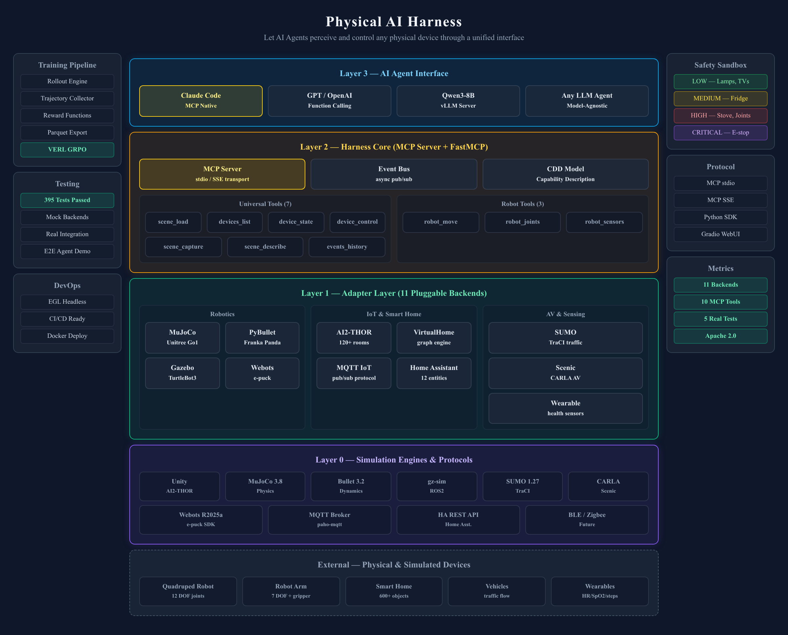

# Physical AI Harness — System Architecture

View source HTML (for Markdown Viewer rendering)

  
  
Physical AI Harness

  
Let AI Agents perceive and control any physical device through a unified interface

  

    

      

Training Pipeline

Rollout Engine

Trajectory Collector

Reward Functions

Parquet Export

VERL GRPO

      

Testing

395 Tests Passed

Mock Backends

Real Integration

E2E Agent Demo

      

DevOps

EGL Headless

CI/CD Ready

Docker Deploy

    

    

      

        
Layer 3 — AI Agent Interface

        

Claude Code <small>MCP Native</small>

GPT / OpenAI <small>Function Calling</small>

Qwen3-8B <small>vLLM Server</small>

Any LLM Agent <small>Model-Agnostic</small>

      

      

        
Layer 2 — Harness Core (MCP Server + FastMCP)

        

MCP Server <small>stdio / SSE transport</small>

Event Bus <small>async pub/sub</small>

CDD Model <small>Capability Description</small>

        

          

            
Universal Tools (7)

            

scene_load

devices_list

device_state

device_control

            

scene_capture

scene_describe

events_history

          

          

            
Robot Tools (3)

            

robot_move

robot_joints

robot_sensors

          

        

      

      

        
Layer 1 — Adapter Layer (11 Pluggable Backends)

        

          

            
Robotics

            

MuJoCo <small>Unitree Go1</small>

PyBullet <small>Franka Panda</small>

            

Gazebo <small>TurtleBot3</small>

Webots <small>e-puck</small>

          

          

            
IoT & Smart Home

            

AI2-THOR <small>120+ rooms</small>

VirtualHome <small>graph engine</small>

            

MQTT IoT <small>pub/sub protocol</small>

Home Assistant <small>12 entities</small>

          

          

            
AV & Sensing

            

SUMO <small>TraCI traffic</small>

            

Scenic <small>CARLA AV</small>

            

Wearable <small>health sensors</small>

          

        

      

      

        
Layer 0 — Simulation Engines & Protocols

        

Unity <small>AI2-THOR</small>

MuJoCo 3.8 <small>Physics</small>

Bullet 3.2 <small>Dynamics</small>

gz-sim <small>ROS2</small>

SUMO 1.27 <small>TraCI</small>

CARLA <small>Scenic</small>

        

Webots R2025a <small>e-puck SDK</small>

MQTT Broker <small>paho-mqtt</small>

HA REST API <small>Home Asst.</small>

BLE / Zigbee <small>Future</small>

      

      

        
External — Physical & Simulated Devices

        

Quadruped Robot <small>12 DOF joints</small>

Robot Arm <small>7 DOF + gripper</small>

Smart Home <small>600+ objects</small>

Vehicles <small>traffic flow</small>

Wearables <small>HR/SpO2/steps</small>

      

    

    

      

Safety Sandbox

LOW — Lamps, TVs

MEDIUM — Fridge

HIGH — Stove, Joints

CRITICAL — E-stop

      

Protocol

MCP stdio

MCP SSE

Python SDK

Gradio WebUI

      

Metrics

11 Backends

10 MCP Tools

5 Real Tests

Apache 2.0

    

  

